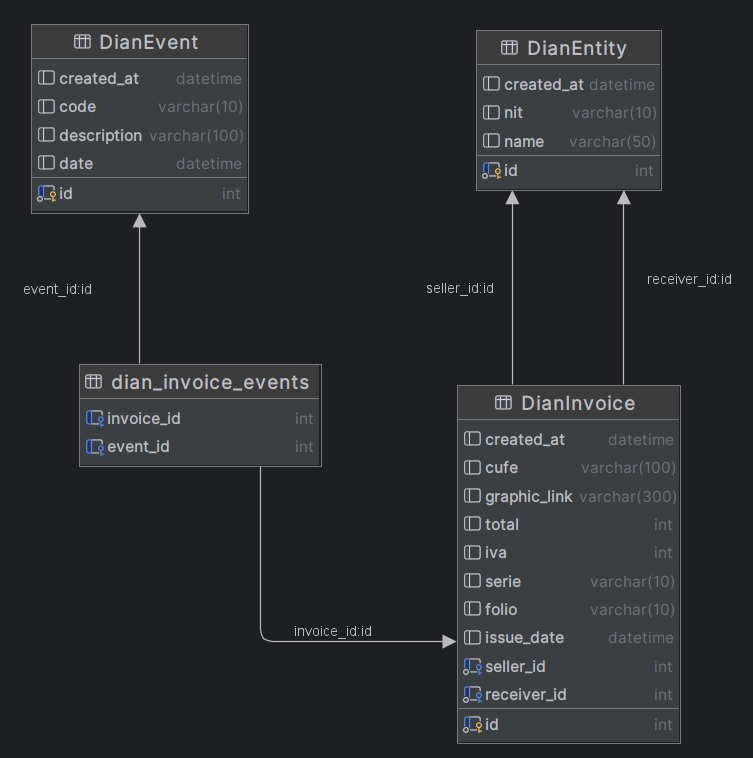

# Dian Invoices Scrapper
This project consists an of a scrapper that obtains information about an invoice from Dian web page, returns the invoice information and that information is stored in a database.

## How to use
1. Execute the command ``` docker compose up mysql``` in the command line to set up the database.
2. Execute the command ``` docker compose up app ``` to set up de app.
3. To consult an invoice information send the cufe with a post request to the endpoint https://localhost:8000/api/v1/get_invoice_information <br>

Body example:
```json
{
  "cufes": [
    "86da9212194f131522f9f450e623ae11086fdc5f782f58706229a71663af58cd11d231de7ad2b8cb13f2d12a263a5c9c",
    "1f28b0cafdafdfc493c2d2abff1168fe99f56395f8c77f7ae492c31972c404ddc54339e51cad28e7e77277a44ca3664e"
  ]
}
```
## Used tools
This scraper was created using Python with FastApi and Selenium, the database is using MySql.

## Database Schema
